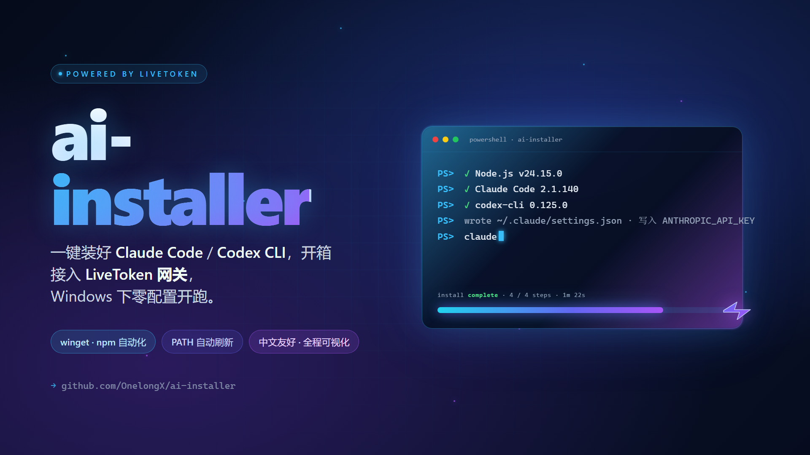

# ai-installer



一组 Windows 桌面安装器，零配置帮你把主流 AI 编码 CLI 装到本机并接入 [LiveToken](https://livetoken.top) 网关。

| 工具 | 装的是 | 默认模型 | 子目录 |
|---|---|---|---|
| [Claude 安装器](./claude/) | [`@anthropic-ai/claude-code`](https://docs.anthropic.com/claude/docs/claude-code) | claude-sonnet-4-5 | [`claude/`](./claude/) |
| [Codex 安装器](./codex/) | [`@openai/codex`](https://www.npmjs.com/package/@openai/codex) | gpt-5.5 (high) | [`codex/`](./codex/) |

> **新版 Claude 安装器 v0.1.3 已自动关闭 `CLAUDE_CODE_ATTRIBUTION_HEADER`**，防止 Claude Code 2.1.36+ 在每个请求里塞的随机化 `cch` 字段把第三方 Anthropic 网关（含 LiveToken）的 prefix cache 命中率打到 0。建议老用户直接覆盖一遍。

两个安装器走的是同一套底层框架（Electron + React + electron-vite），共享的修复和最佳实践都收敛在双方源码里：

- Windows `spawn` 含空格路径的引号修复
- `chcp 65001` 强制 UTF-8 输出，杜绝中文系统 GBK 乱码
- 多层命令查找：cmd.exe PATH+PATHEXT → 静态路径表 → `where.exe` 反查
- 装完 Node / CLI 后从注册表刷新 process PATH
- 安装命令 10 分钟超时，验证命令 60 秒
- preload 桥直接用 electron-vite 打包产物，契约测试守住通道一致性

## 下载

最新版本：[Releases v0.1.2](https://github.com/OnelongX/ai-installer/releases/tag/v0.1.2)

| 文件 | 类型 |
|---|---|
| [`Claude-Installer-Portable-0.1.3.exe`](https://github.com/OnelongX/ai-installer/releases/download/v0.1.3/Claude-Installer-Portable-0.1.3.exe) | Claude · 便携 |
| [`Claude-Installer-Setup-0.1.3.exe`](https://github.com/OnelongX/ai-installer/releases/download/v0.1.3/Claude-Installer-Setup-0.1.3.exe) | Claude · NSIS |
| [`Codex-Installer-Portable-0.1.2.exe`](https://github.com/OnelongX/ai-installer/releases/download/v0.1.2/Codex-Installer-Portable-0.1.2.exe) | Codex · 便携 |
| [`Codex-Installer-Setup-0.1.2.exe`](https://github.com/OnelongX/ai-installer/releases/download/v0.1.2/Codex-Installer-Setup-0.1.2.exe) | Codex · NSIS |

文件未签名，Windows SmartScreen 第一次会提示"未识别的应用"，点"更多信息 → 仍要运行"即可。

## 使用教程

每个安装器的步骤都一样：

1. 在 [LiveToken](https://livetoken.top) 注册并生成一把 API Key
2. 下载对应的便携版或安装包，双击启动
3. 输入 API Key → 看环境检测 → 确认安装计划 → 点开始
4. 完成后**新开一个**终端，跑 `claude` 或 `codex` 验证

详细分步教程：

- Claude 安装器使用说明 → [`claude/README.md`](./claude/README.md)
- Codex 安装器使用说明 → [`codex/README.md`](./codex/README.md)

## 自己 build

每个子目录是独立的 npm 项目：

```bash
git clone https://github.com/OnelongX/ai-installer.git
cd ai-installer/claude        # 或 cd ai-installer/codex
npm install
npm test                      # 单测 + 组件测试
npm run build                 # 输出 out/
npm run pack:win              # 便携版
npm run dist:win              # NSIS 安装包
```

需要：Node ≥ 20、Windows 10/11、winget。

## License

MIT —— 见 [LICENSE](./LICENSE)。
