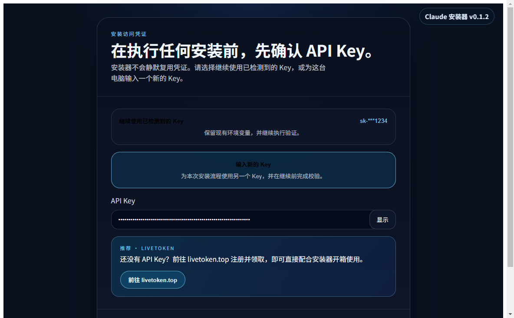
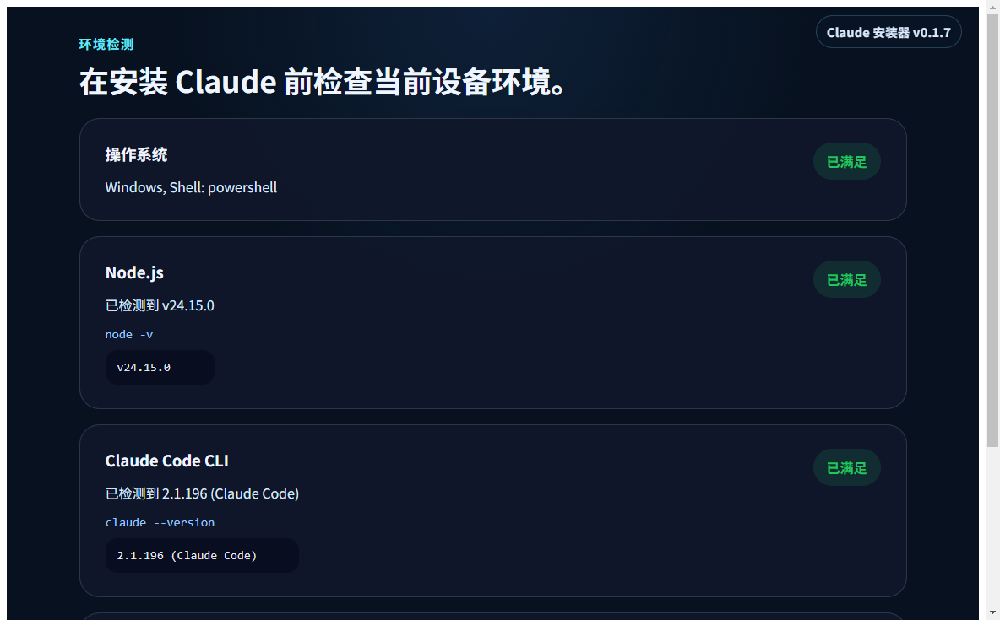
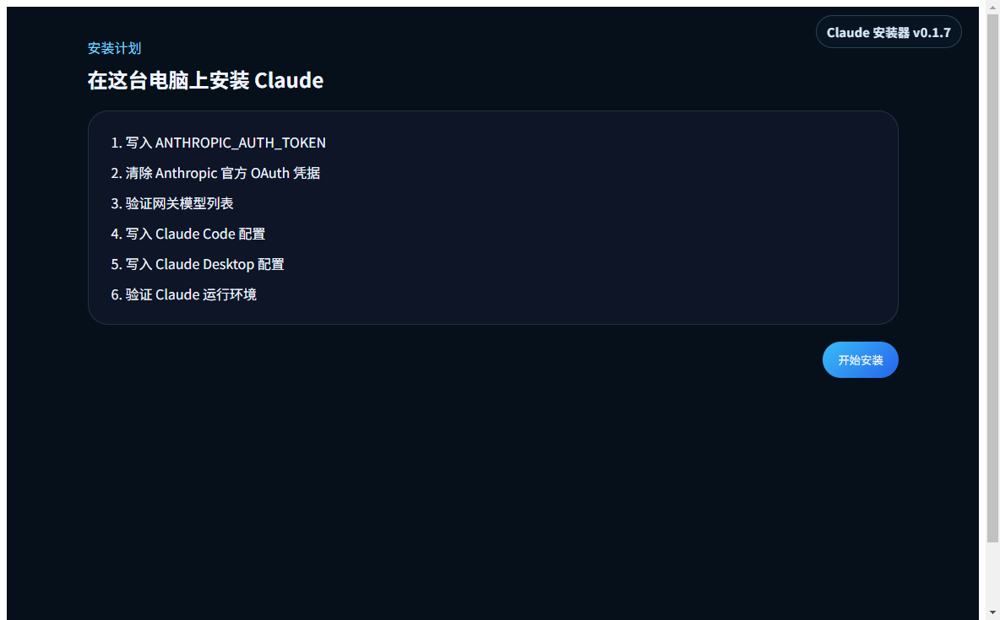
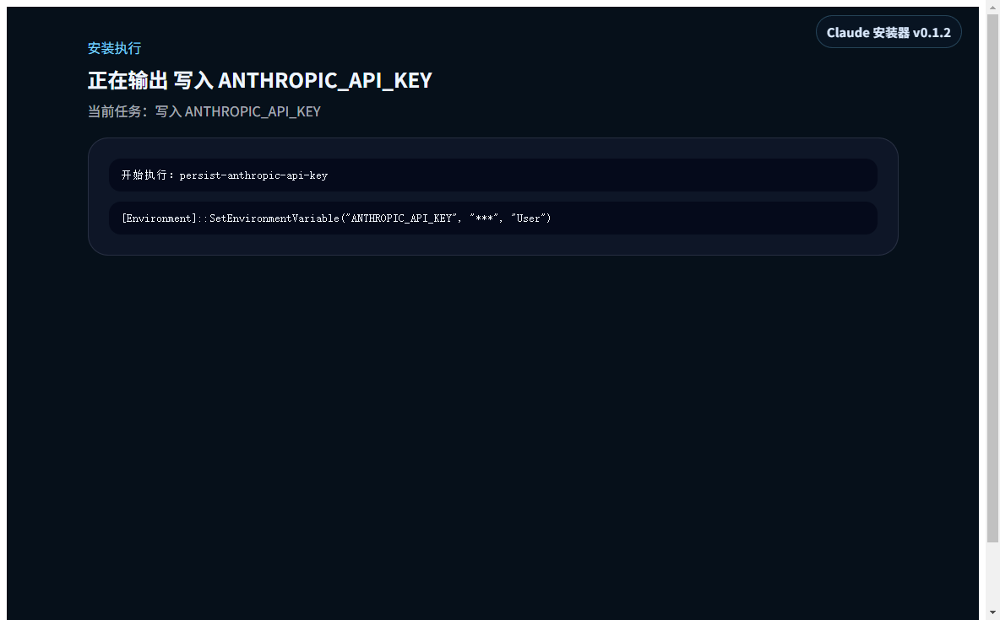
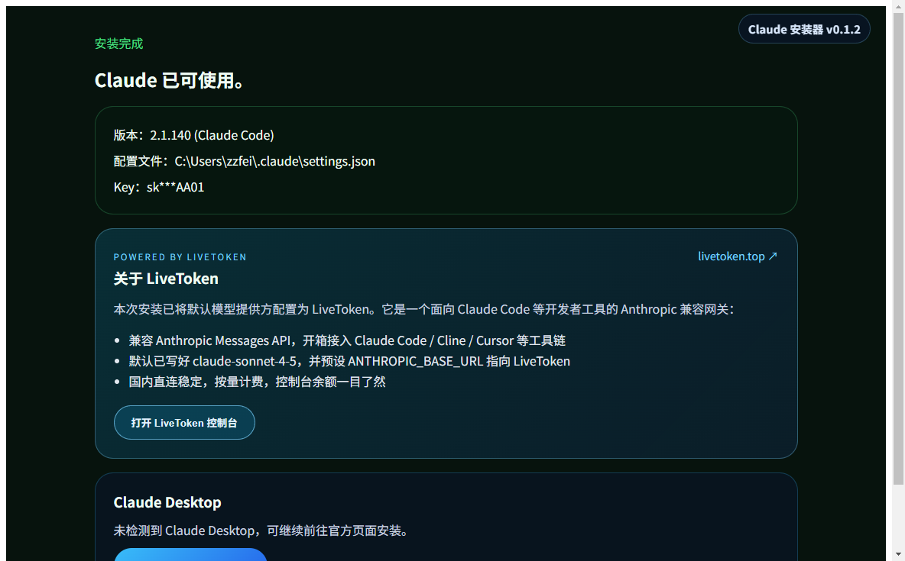

# Claude 安装器 · ai-installer

一个 Windows 桌面工具，零配置帮你在本机装好 [Claude Code CLI](https://docs.anthropic.com/claude/docs/claude-code) 并接入 [LiveToken](https://livetoken.top/) 网关。

  

---

## 它会替你做什么

| 步骤 | 内容 |
|---|---|
| ① 检测 | 检查 Node.js、Claude Code CLI、`~/.claude/settings.json` 是否就位 |
| ② 装 Node | 缺则用 `winget install OpenJS.NodeJS.LTS` 自动装上 |
| ③ 装 CLI | `npm i -g @anthropic-ai/claude-code` |
| ④ 写 Key | `ANTHROPIC_API_KEY` 写入 Windows 用户环境变量 |
| ⑤ 写配置 | 在 `%USERPROFILE%\.claude\settings.json` 写好默认模型、BASE_URL 等 |
| ⑥ 验证 | `claude --version` 跑通即成功 |

所有失败步骤都能单独**重试**，关掉重开还能从上次失败处**继续**。

---

## 下载

最新版本：[Releases 页](https://github.com/OnelongX/ai-installer/releases/latest)

| 类型 | 文件 | 适用场景 |
|---|---|---|
| 便携版 | [`Claude-Installer-Portable-0.1.3.exe`](https://github.com/OnelongX/ai-installer/releases/download/v0.1.3/Claude-Installer-Portable-0.1.3.exe) | 双击即用，不写注册表 |
| 安装包 | [`Claude-Installer-Setup-0.1.3.exe`](https://github.com/OnelongX/ai-installer/releases/download/v0.1.3/Claude-Installer-Setup-0.1.3.exe) | 标准 NSIS 安装到 Program Files，带桌面快捷方式 |

> 文件未做代码签名，Windows SmartScreen 第一次会弹"未识别的应用"，点"更多信息 → 仍要运行"即可。

---

## 使用教程

### 1. 准备一把 LiveToken Key

去 [https://livetoken.top](https://livetoken.top) 注册并生成一把 Key，形如 `sk-ant-xxx...` 或 `sk-xxx...`。

### 2. 启动安装器，输入 API Key

双击便携版 `.exe` 或安装后从桌面启动。进入欢迎页 → 在「API Key」输入框粘贴你的 LiveToken Key（以 `sk-` 开头），点"继续"。



> 如果之前装过，安装器会自动检测到已有 Key，可以直接复用。

### 3. 查看环境检测

下一页安装器会自检本机环境，列出系统、Node.js、Claude Code CLI、配置文件 4 项的状态。**绿色"已满足"**表示无需处理；其余会标成"自动修复"，由后面的安装步骤补齐。



确认无误后点"继续到安装计划"。

### 4. 确认安装计划

根据上一步的检测结果，安装器会动态生成最少必要的任务列表 —— 已装好的不会重复跑。



点右下角"开始安装"启动全自动流程：

- 装 Node 用 `winget`（首次需要 UAC 提权，弹出来允许即可）
- 装 Claude Code CLI 用 `npm i -g @anthropic-ai/claude-code`，国内网络可能要 1–3 分钟
- 写配置和环境变量是秒级
- 最后跑一次 `claude --version` 验证

### 5. 执行过程

执行页会实时滚动每条命令的输出。中间任何一步失败，UI 会标红那一行，点"重试当前步骤"就能从失败点恢复。



### 6. 完成

成功后能看到 Claude Code CLI 版本号、配置文件路径、API Key 掩码，以及一张 LiveToken 控制台入口卡。



**新开一个 PowerShell / Terminal** 跑：

```powershell
claude --version
claude
```

显示版本号并能进 Claude Code REPL 就成了。

> 注意：环境变量是写到"用户级"，**当前已打开的终端窗口看不到**新值，必须**新开一个**。

---

## 默认配置长啥样

安装完成后 `%USERPROFILE%\.claude\settings.json`：

```json
{
  "env": {
    "ANTHROPIC_BASE_URL": "https://livetoken.top",
    "ANTHROPIC_MODEL": "claude-sonnet-4-5",
    "ANTHROPIC_SMALL_FAST_MODEL": "claude-sonnet-4-5",
    "CLAUDE_CODE_DISABLE_NONESSENTIAL_TRAFFIC": "0",
    "CLAUDE_CODE_ATTRIBUTION_HEADER": "0"
  },
  "model": "claude-sonnet-4-5",
  "permissions": { "defaultMode": "acceptEdits" },
  "autoUpdaterStatus": "enabled",
  "includeCoAuthoredBy": false
}
```

想换模型 / 网关，直接改这个文件即可。

> **关于 `CLAUDE_CODE_ATTRIBUTION_HEADER=0`**：Claude Code 自 2.1.36 起会在每个请求的 system prompt 第一块塞一个 `x-anthropic-billing-header`，其中 `cch` 字段每次请求随机变化。Anthropic 自家服务端会剥掉它再算 prefix-cache key，但**所有第三方 Anthropic 兼容代理（LiveToken / Bedrock / vLLM 等）都不知道**，会把它当成 prompt 的一部分参与缓存哈希，导致 prefix cache 永远不命中，token 消耗暴涨、推理变慢。这个 env 把 header 关掉，缓存命中恢复正常。

---

## 常见问题

**Q：装到一半报 `spawn npm ENOENT`？**
A：极少数自定义路径安装的 Node 没被 PATH/PATHEXT 解析到。安装器已经做了三层兜底（静态路径表、cmd.exe PATH+PATHEXT、`where.exe` 反查）。如果还出，开 PowerShell 跑 `where.exe npm`，把返回路径发到 issue。

**Q：装到一半报 `C:\Program 不是命令` 或一串乱码？**
A：这是 Node 老版本 spawn 在 Windows 上的引号 bug。本工具内部已修，正常不会再出现。如果还有，提 issue。

**Q：装完跑 `claude` 提示找不到命令？**
A：必须开**新**终端窗口。环境变量更新只对新进程生效。

**Q：要换 base URL 或换模型？**
A：直接编辑 `%USERPROFILE%\.claude\settings.json`。Claude Code 启动时读这个文件。

**Q：怎么卸？**
A：
1. NSIS 版从控制面板"添加或删除程序"卸载工具本身
2. CLI 卸载：`npm uninstall -g @anthropic-ai/claude-code`
3. 清配置：删 `%USERPROFILE%\.claude\` 目录
4. 清 Key：PowerShell 跑 `[Environment]::SetEnvironmentVariable('ANTHROPIC_API_KEY', $null, 'User')`

---

## 自己 build

```bash
git clone https://github.com/OnelongX/ai-installer.git
cd ai-installer
npm install
npm test                    # 跑 67 个单测 + 组件测试
npm run build               # 输出 out/
npm run pack:win            # 出便携版 release/*.exe
npm run dist:win            # 出 NSIS 安装包
```

需要：Node ≥ 20、Windows 10/11、winget（系统自带）。

---

## 工作原理 / 修过的坑

简短说几个核心点（细节见各模块注释）：

- **exec quoting**：Windows 下 `spawn(cmd, args, {shell: true})` 不会自动给含空格的命令路径加引号，安装器用 `cmd.exe /d /s /c` + `windowsVerbatimArguments` 自己控制命令行
- **UTF-8 输出**：每条命令前置 `chcp 65001>nul &`，防止中文 Windows 上 stderr 被当 GBK 显示成乱码
- **PATH 多层兜底**：直接 spawn → cmd.exe PATH+PATHEXT → 静态路径表（Program Files / LocalAppData / AppData\npm / Volta）→ `where.exe` 运行时反查
- **PATH 刷新**：装完 Node/CLI 后用 PowerShell 读注册表 `User+Machine PATH` 写回 `process.env.PATH`，让后续步骤的命令解析能看到新装的工具
- **超时分级**：安装命令 10 分钟，验证命令 60 秒（默认 30s 对 winget 来说太短）
- **preload 契约**：preload 不再手写，直接打包 TS 编译产物；契约测试确保 `Object.keys(api) === Object.keys(ipcChannels)`，防漂移

---

## 项目结构

```
src/
├── main/                       # Electron 主进程
│   ├── installer/
│   │   ├── plan.ts             # 任务规划
│   │   ├── service.ts          # 安装编排
│   │   ├── session-controller.ts  # 持久化 + 恢复
│   │   ├── task-runner.ts      
│   │   └── tasks/
│   │       ├── detect-claude.ts
│   │       ├── detect-config.ts
│   │       ├── detect-node.ts
│   │       ├── detect-system.ts
│   │       ├── install-claude.windows.ts
│   │       ├── install-node.windows.ts
│   │       ├── persist-api-key.windows.ts
│   │       └── write-config.windows.ts
│   ├── desktop-app/windows.ts  # Claude Desktop 探测
│   └── system/
│       ├── exec.ts             # spawn + 超时 + 编码 + 引号修复
│       └── windows-command.ts  # 命令查找兜底链
├── preload/index.ts            # IPC 桥（唯一一份，打包后直接用）
├── renderer/                   # React UI
│   ├── App.tsx
│   ├── features/
│   │   ├── api-key/
│   │   ├── complete/           # 完成页 + LiveToken 介绍卡
│   │   ├── detection/
│   │   ├── execution/
│   │   ├── plan/
│   │   ├── recovery/
│   │   └── repair/
│   └── install-flow/client.ts  # 渲染端 IPC client
└── shared/                     # 两端共用的类型 / IPC 通道定义
```

---

## License

MIT
